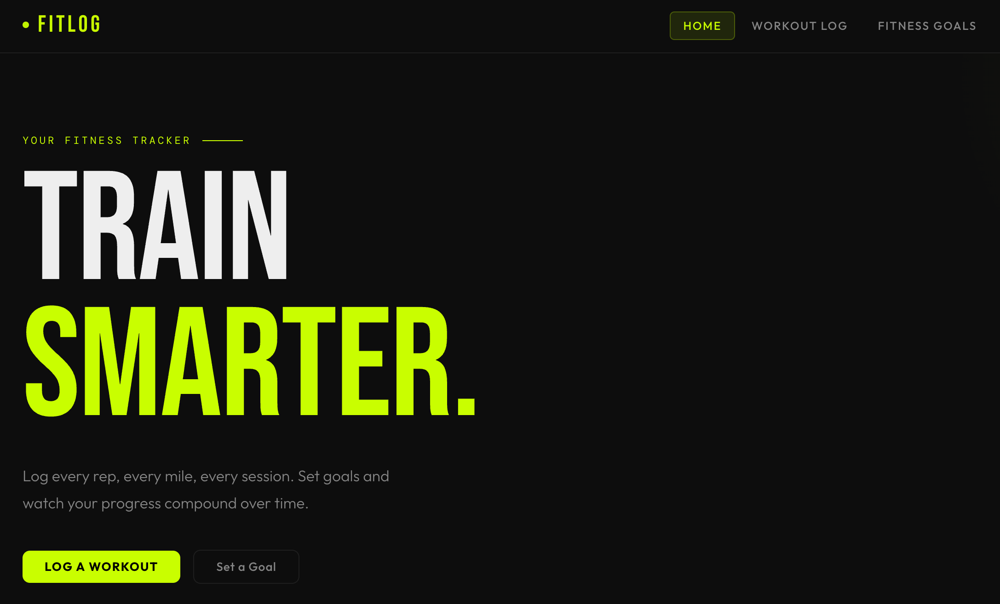

# FitLog

A full-stack fitness tracking web application for logging workouts and managing fitness goals.

🔗 **[Live Demo](fitlog-git-main-the-jamesjacksons-projects.vercel.app)**



> **Note:** This app currently uses a shared database 😅 — but authentication is planned as a future feature!

## Tech Stack

**Frontend:** React, React Router, Vite
**Backend:** Node.js, Express
**Database:** PostgreSQL (Neon)
**Deployment:** Vercel (frontend), Render (backend)

## Features

- Log workouts with exercise type, date, duration, and optional notes
- Create and track fitness goals with optional category and deadline
- Edit and delete workouts and goals
- Toggle goal completion status
- Full CRUD operations for workouts and goals
- 20 supported activity types
- Responsive design

## Setup

### Prerequisites
- Node.js (v14+)
- PostgreSQL (v12+)

### Installation

1. **Clone the repository**
```bash
git clone https://github.com/the-jamesjackson/FitLog.git
cd FitLog
```

2. **Install dependencies**
```bash
cd backend && npm install
cd ../frontend && npm install
```

3. **Set up database**

   Create a PostgreSQL database and run:
```sql
CREATE TABLE exercise_types (
    id SERIAL PRIMARY KEY,
    name TEXT NOT NULL
);

CREATE TABLE workouts (
    id SERIAL PRIMARY KEY,
    exercise_id INTEGER NOT NULL REFERENCES exercise_types(id),
    date DATE NOT NULL,
    duration INTEGER NOT NULL,
    notes TEXT
);

CREATE TABLE goals (
    id SERIAL PRIMARY KEY,
    text TEXT NOT NULL,
    category TEXT,
    deadline DATE,
    completed BOOLEAN DEFAULT FALSE
);

INSERT INTO exercise_types (name) VALUES
    ('Calisthenics'), ('Climbing'), ('CrossFit'), ('Cycling'),
    ('Elliptical'), ('HIIT'), ('Hiking'), ('Meditation'),
    ('Pilates'), ('Running'), ('Skiing'), ('Snowboarding'),
    ('Sports'), ('Stair Climbing'), ('Stretching'), ('Surfing'),
    ('Swimming'), ('Walking'), ('Weightlifting'), ('Yoga');
```

4. **Configure environment variables**

   Create `.env` in the backend directory:
```
DATABASE_URL=your_postgresql_connection_string
NODE_ENV=development
```

   Create `.env` in the frontend directory:
```
VITE_API_URL=http://localhost:3000
```

5. **Run the application**
```bash
# Terminal 1 - Backend
cd backend
node index.js

# Terminal 2 - Frontend
cd frontend
npm run dev
```

   Backend: `http://localhost:3000`
   Frontend: `http://localhost:5173`

## API Endpoints

| Method | Endpoint | Description |
|--------|----------|-------------|
| GET | `/api/exercises` | Get all exercise types |
| GET | `/api/workouts` | Get all workouts |
| POST | `/api/workouts` | Create a workout |
| PUT | `/api/workouts/:id` | Update a workout |
| DELETE | `/api/workouts/:id` | Delete a workout |
| GET | `/api/goals` | Get all goals |
| POST | `/api/goals` | Create a goal |
| PUT | `/api/goals/:id` | Update a goal |
| PUT | `/api/goals/:id/toggle` | Toggle goal completion |
| DELETE | `/api/goals/:id` | Delete a goal |
